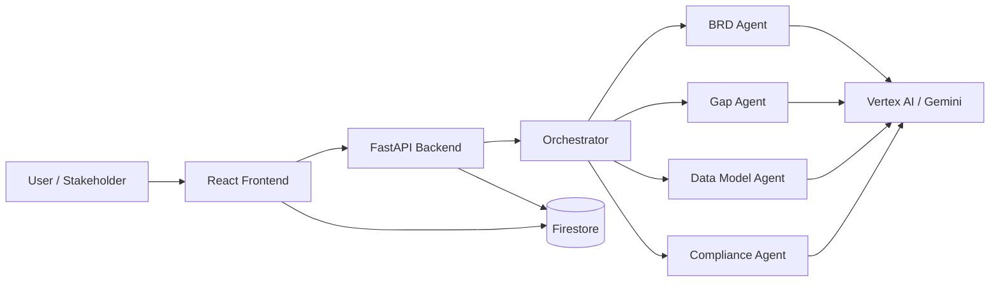
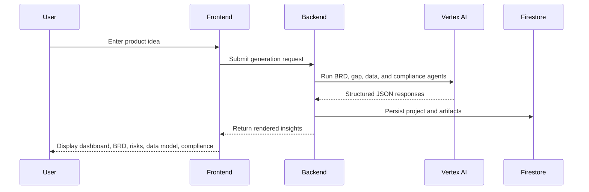

# Samvad

A modern AI platform for transforming scattered conversations, emails, and raw product ideas into structured business, technical, and compliance-ready artifacts.


## Overview

Samvad is an enterprise-inspired AI workflow that turns unstructured context into a polished set of deliverables for product, engineering, and compliance stakeholders. It combines multi-source ingestion from chats, emails, and product notes with a multi-agent orchestration layer and deterministic validation to produce structured outputs such as BRDs, gap analyses, data models, architecture insights, and compliance recommendations.

Whether you are validating a startup idea, consolidating stakeholder discussions, or transforming email threads into actionable requirements, Samvad helps teams move from ambiguity to clarity in minutes.

## Why Samvad

- Ingest context from chats, emails, meeting notes, and product ideas
- Extract relevant requirements, goals, constraints, and stakeholders automatically
- Transform scattered inputs into a structured BRD with clear scope and priorities
- Surface risks, missing requirements, and clarifying questions early
- Produce normalized data models and sensitivity-aware compliance insights
- Deliver a polished, modern experience for stakeholders and technical teams
- Maintain a secure, scalable foundation with Firebase and Google Cloud services

## System Architecture



## Workflow



## Core Capabilities

### Context Ingestion & Intelligence
- Import context from chat threads, email exchanges, and free-form notes
- Extract relevant business intent, user needs, constraints, and dependencies
- Identify entities, workflows, and decision points from unstructured sources
- Build a structured knowledge base for downstream BRD generation

### AI-Powered Artifact Generation
- Business Requirements Document generation from multi-source context
- Gap and risk analysis
- Data model and data dictionary creation
- Compliance and security review
- Optional architecture visualization

### Modern Product Experience
- Intuitive workspace-based interface
- Searchable project and BRD library
- Guest and authenticated modes
- Settings, profile, and security management
- Responsive, polished UI powered by Tailwind and Radix primitives

### Enterprise-Ready Foundations
- Secure authentication with Firebase
- Structured output validation using Pydantic
- Cloud-native storage and backend services
- Extensible orchestration for future AI agents and workflows

## Tech Stack

| Layer | Technologies |
| --- | --- |
| Frontend | React, TypeScript, Vite, Tailwind CSS, Framer Motion, Radix UI |
| Backend | Python, FastAPI, Uvicorn |
| AI | Google Vertex AI, Gemini models |
| Data | Firestore, Pydantic |
| Auth | Firebase Authentication, Firebase Admin SDK |
| DevOps | Docker, Google Cloud Run |

## Quick Start

### Prerequisites
- Python 3.11+
- Node.js 18+
- A Google Cloud project with Vertex AI enabled
- A Firebase project with Authentication and Firestore configured

### Option 1: Use the helper script

On Windows:

```powershell
start-dev.bat
```

### Option 2: Run manually

Backend:

```bash
cd backend
python -m venv .venv
source .venv/bin/activate
# Windows: .venv\Scripts\activate
pip install -r requirements.txt
```

Then start the API:

```bash
uvicorn backend.main:app --reload --port 8080
```

Frontend:

```bash
cd frontend
npm install
npm run dev
```

Open http://localhost:5173 to view the application.

## Environment Setup

Configure the following before running the app:

- Backend environment variables for Google Cloud and Firebase access
- Frontend Firebase configuration values for authentication
- Optional service account credentials for Vertex AI access

## Project Structure

```text
samvad/
├── backend/
│   ├── routes/
│   ├── schemas/
│   ├── services/
│   └── utils/
├── frontend/
│   ├── src/
│   │   ├── components/
│   │   ├── api/
│   │   └── assets/
├── docs/
├── scripts/
└── README.md
```

## Development Notes

- The backend uses a deterministic multi-agent pipeline to generate structured outputs
- Each agent response is validated using schema-based rules for reliability
- The frontend is designed to be presentation-ready for demos, stakeholder reviews, and iterative product design

## Roadmap

- Expanded agent orchestration for deeper architecture planning
- Richer export workflows such as PDF and Word delivery
- Improved analytics and auditability for generated artifacts
- Team collaboration, versioning, and shared workspaces

## Contributing

Contributions are welcome. If you are improving the product experience, strengthening the backend pipeline, or adding new agent capabilities, feel free to open an issue or submit a pull request.

## Contact

For questions, collaboration, or product feedback, reach out through the project repository or the maintainers listed in the workspace.

